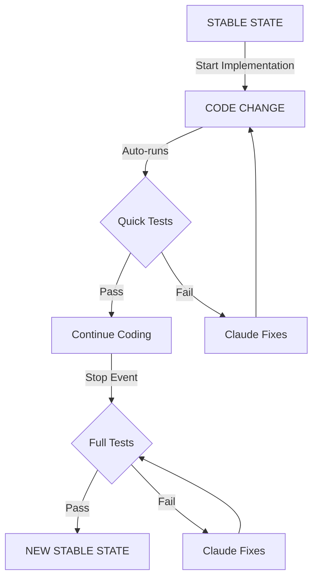

# Regression Test Setup & Usage

### 1. Run Setup in Claude Code
```bash
/regression-testing-feedback-cycle
```

### 2. Provide Test Commands 
quick/fast test suite vs full/thorough test suite
```bash
QUICK: npm run test:unit
FULL: npm run test
```

### 3. Start Coding
Tests now run automatically during development

## Visual Flow

***Note: This Mermaid diagram will render properly when viewed in Docusaurus documentation or GitHub***



## Control Commands

```bash
# Enable/Disable
./claude/hooks/regression-control.sh enable
./claude/hooks/regression-control.sh disable

# Check Status
./claude/hooks/regression-control.sh status
```

## Example Session

```
User: /regression-testing-feedback-cycle
Claude: What are your test commands?

User: Quick: npm test:unit, Full: npm test
Claude: ✅ Regression cycle setup complete!

User: Add user authentication feature
Claude: Starting implementation...
        [edits auth.js]
        🔄 Running quick tests... ✅ Passed
        [edits login.vue]
        🔄 Running quick tests... ❌ Failed
        Fixing test failure...
        🔄 Running quick tests... ✅ Passed
        
User: [Stops session]
Claude: 🔄 Running full test suite...
        ✅ STABLE STATE ACHIEVED!
```