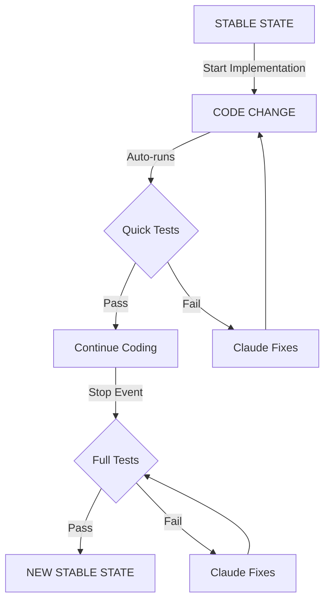

# Regression Test Setup & Usage

### 1. Run Setup in Claude Code

```bash
/regression-testing-feedback-cycle
```

### 2. Auto-Detection

System automatically detects your test commands from:
- package.json / deno.json
- Makefile / go.mod / Cargo.toml
- Falls back to manual input if needed

### 3. Choose Mode and Start

```bash
./.claude/hooks/regression-control.sh smart  # Only test changed files (fastest)
./.claude/hooks/regression-control.sh on     # Test everything (safest)
```

## Visual Flow

_**Note: This Mermaid diagram will render properly when viewed in Docusaurus documentation or GitHub**_



## Control Commands

```bash
# Modes
./.claude/hooks/regression-control.sh smart   # Only test changed files
./.claude/hooks/regression-control.sh cached  # Skip unchanged tests
./.claude/hooks/regression-control.sh on      # Run all tests
./.claude/hooks/regression-control.sh off     # Disable testing

# Status
./.claude/hooks/regression-control.sh status
```

## Example Session

```
User: /regression-testing-feedback-cycle
Claude: Detecting test configuration...
        Found: npm test:unit (312ms), npm test (4.2s)
        Setting up optimized test runners...
        Performance: 312ms -> 89ms (3.5x faster with smart mode)
        Setup complete!

User: ./.claude/hooks/regression-control.sh smart
Output: Regression testing ENABLED (smart mode - only changed files)

User: Add user authentication feature
Claude: [edits auth.js]
        Running quick tests (smart mode - auth tests only)... Passed
        [edits login.vue]
        Running quick tests (smart mode - login tests only)... Failed
        Fixing test failure...
        Running quick tests... Passed
        
User: [Stops session]
Claude: Running full test suite...
        STABLE STATE ACHIEVED!
```
