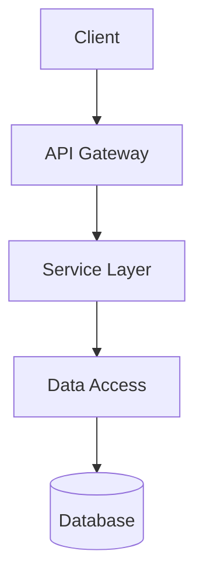
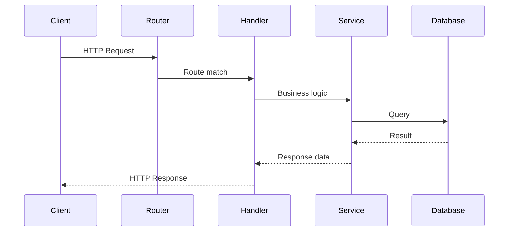
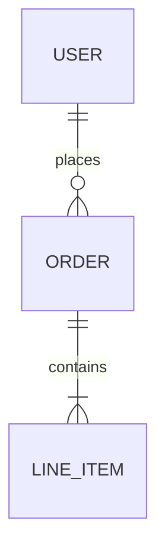

# Onboard

Systematically explore an unfamiliar codebase and produce a comprehensive ARCHITECTURE.md document. This skill is designed for the first encounter with a repository -- when you need to understand what it is, how it works, and how to contribute.

## Workflow

### Phase 1: Repository Surface Scan

Quickly establish the shape of the repository without reading deeply into any single file.

1. **Root directory inventory**:
   - List all top-level files and directories
   - Note the presence of key files: README, LICENSE, Makefile, deno.json, package.json, Cargo.toml, go.mod, pom.xml, build.gradle, docker-compose.yml, Dockerfile, .github/workflows/*, Taskfile.yml, justfile

2. **File type census**:
   - Count files by extension to understand the language mix
   - Use `wc -l` on key directories to gauge relative size
   - Identify the dominant language(s)

3. **Dependency manifest analysis**:
   - Read dependency files (go.mod, Cargo.toml, package.json, deno.json, pom.xml, build.gradle, requirements.txt, etc.)
   - Identify frameworks, libraries, and their versions
   - Note dev dependencies vs production dependencies
   - Flag any vendored or forked dependencies

4. **Configuration files**:
   - Read CI/CD configs (.github/workflows/*.yml, .gitlab-ci.yml, Jenkinsfile)
   - Read linter/formatter configs (.eslintrc, rustfmt.toml, .golangci.yml, checkstyle.xml)
   - Read container configs (Dockerfile, docker-compose.yml)
   - Read infrastructure configs (terraform/, k8s/, helm/)

### Phase 2: Entry Point Discovery

Identify how the application starts, how requests flow in, and where the main business logic lives.

1. **Application entry points**:
   - Find main() functions, server startup files, or framework bootstrapping
   - For web services: find route definitions, controller registrations, handler mappings
   - For CLI tools: find command registration and argument parsing
   - For libraries: find the public API surface (exported modules, public types)

2. **Request/data flow tracing**:
   - Starting from entry points, trace the path of a typical request or operation
   - Identify middleware chains, interceptors, filters
   - Find where business logic is invoked from routing/dispatch layers
   - Locate data access layers (repositories, DAOs, database clients)

3. **External interface boundaries**:
   - Find API definitions (OpenAPI specs, protobuf files, GraphQL schemas, WSDL)
   - Identify message queue consumers/producers
   - Locate scheduled jobs or cron handlers
   - Find webhook handlers or event listeners

### Phase 3: Architecture Mapping

Build a mental model of the system architecture and document it.

1. **Module/package structure**:
   - Map the directory tree to logical modules
   - Identify the layering strategy (hexagonal, clean architecture, MVC, flat, monolith, etc.)
   - Note module boundaries and how they communicate

2. **Dependency graph**:
   - For each major module, identify what it depends on (internal and external)
   - Identify circular dependencies if any
   - Note the direction of dependencies (do they point inward toward domain or outward?)

3. **Data model survey**:
   - Find database migration files or schema definitions
   - Identify ORM models, entity classes, or table definitions
   - Note relationships between core data types
   - Find seed data or fixture files

4. **Infrastructure and deployment**:
   - Identify how the application is deployed (containers, serverless, bare metal)
   - Note environment configuration strategy (env vars, config files, secrets management)
   - Identify external services the application depends on (databases, caches, queues, third-party APIs)

### Phase 4: Pattern Cataloging

Identify recurring patterns and conventions used throughout the codebase.

1. **Code patterns**:
   - Error handling strategy (error types, Result/Option usage, exception hierarchy)
   - Logging approach (structured logging, log levels, correlation IDs)
   - Testing patterns (unit test organization, integration test setup, mocking strategy)
   - Concurrency patterns (async/await, goroutines, thread pools, actors)
   - Configuration loading pattern
   - Dependency injection approach (if any)

2. **Naming conventions**:
   - File naming (snake_case, camelCase, kebab-case)
   - Type naming conventions
   - Package/module naming strategy
   - Test file naming and organization

3. **Project-specific idioms**:
   - Custom macros, decorators, or annotations
   - Internal utility libraries or helper modules
   - Domain-specific abstractions
   - Shared traits/interfaces that define the project vocabulary

### Phase 5: Developer Workflow Documentation

Understand how a developer works with this codebase day-to-day.

1. **Build and run**:
   - How to build the project from scratch
   - How to run the application locally
   - How to run with hot-reload or watch mode
   - Required environment variables or configuration

2. **Testing**:
   - How to run the full test suite
   - How to run a single test
   - Test categories (unit, integration, e2e) and how to run each
   - Test data setup requirements

3. **Development dependencies**:
   - Required system-level tools (compilers, runtimes, databases)
   - Required environment setup (env vars, config files, certificates)
   - Docker or container dependencies for local development

4. **Contribution workflow**:
   - Branch naming conventions (if discoverable from git log)
   - CI/CD pipeline stages
   - Code review requirements (CODEOWNERS, required checks)
   - Release process (tags, changelogs, versioning strategy)

### Phase 6: Generate ARCHITECTURE.md

Write the final document to `ARCHITECTURE.md` in the repository root. Use the following structure:

````markdown
# Architecture: <project-name>

> One-paragraph summary of what this project is, its primary purpose, and its core technology choices.

## Tech Stack

| Layer      | Technology | Version | Notes |
| ---------- | ---------- | ------- | ----- |
| Language   | ...        | ...     | ...   |
| Framework  | ...        | ...     | ...   |
| Database   | ...        | ...     | ...   |
| Cache      | ...        | ...     | ...   |
| Queue      | ...        | ...     | ...   |
| Build      | ...        | ...     | ...   |
| CI/CD      | ...        | ...     | ...   |
| Deployment | ...        | ...     | ...   |

## Project Structure

<Brief description of directory layout and module organization.>

<Directory tree showing top 2-3 levels with annotations for key directories.>

## Architecture Overview

<High-level Mermaid diagram showing major components and their relationships.>


````

## Entry Points

| Entry Point | File        | Purpose                |
| ----------- | ----------- | ---------------------- |
| Main        | src/main.rs | Application startup    |
| HTTP Routes | src/routes/ | Request handling       |
| CLI         | src/cli.rs  | Command-line interface |

## Request Flow

<Mermaid sequence diagram showing a typical request lifecycle.>



## Data Model

<Key entities and their relationships. Use a Mermaid ER diagram if the model is relational.>



## Key Patterns

### Error Handling

<Description of error handling approach.>

### Testing Strategy

<Description of test organization and approach.>

### Configuration

<How the application is configured.>

### Logging

<Logging approach and conventions.>

## Development Workflow

### Prerequisites

<Required tools and setup.>

### Quick Start

```bash
<Minimal commands to build and run.>
```

### Running Tests

```bash
<Commands to run different test categories.>
```

### Common Tasks

```bash
<Frequently needed commands.>
```

## External Dependencies

| Service    | Purpose           | Configuration |
| ---------- | ----------------- | ------------- |
| PostgreSQL | Primary datastore | DATABASE_URL  |
| ...        | ...               | ...           |

## Deployment

<Brief description of how the application is deployed.>
```

## Guidelines

- **Read broadly, not deeply**: The goal is to understand the shape and structure of the codebase, not to comprehend every line of code. Skim files to identify patterns, then move on.
- **Prioritize accuracy over completeness**: It is better to document what you are confident about than to guess. If something is unclear, note it as "needs further investigation" rather than speculating.
- **Use Mermaid diagrams liberally**: Visual representations of architecture, data flow, and relationships are far more useful than paragraphs of prose. Every major section should have a diagram if the content warrants it.
- **Keep the output scannable**: Use tables, bullet points, and code blocks. Avoid long paragraphs. A developer should be able to find what they need in under 30 seconds.
- **Document what surprised you**: If a pattern is unusual or non-obvious, call it out explicitly. These are the things that trip up new contributors.
- **Do not modify any source code**: This skill is strictly read-only exploration. The only file written is ARCHITECTURE.md.
- **Respect file size limits**: For very large files (>500 lines), read the first 100 lines and the last 50 lines, then use Grep to find specific patterns rather than reading the entire file.
